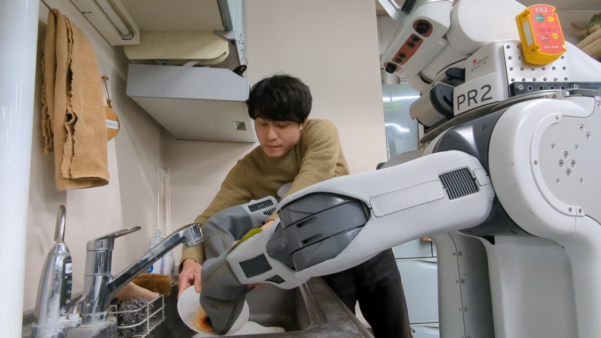

  <a href="{{ site.baseurl }}/projects/dish_wash" class="project-card">
    

      
    

    

      <h3>Behavioral learning of dish rinsing and scrubbing based on interruptive direct teaching considering assistance rate</h3>
      
<strong>S. Wakabayashi</strong>. K. Kawaharazuka, K. Okada, M. Inaba

      
Advanced Robotics (<strong>AR</strong>)

    

  </a>

  <a href="https://youtu.be/yTRQobeZ6Yg?si=i81BgO6v3kkFjel2" class="project-card">
    

      
    

    

      <h3>京都大学「おもろチャレンジ」 - 技術革新が世界を変える！</h3>
    

  </a>

  <!-- 他のプロジェクトカードも同様に追加 -->

